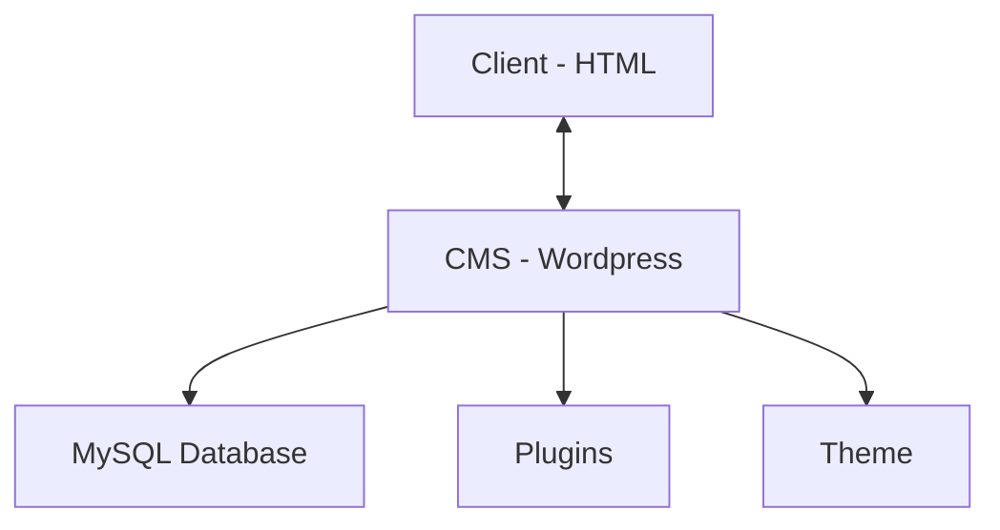

# Architecture

This document contains the technical decisions and information made in the development of this Wordpress application for future reference.

At a high level, the Wordpress site is made up of the following components:



## Application

The Wordpress application is made up of pages, posts, plugins and themes. The pages and posts are created by the website owner/administrator, the plugins extend the functionality of the base Wordpress application and are created by developers (open-source and paid). Lastly, the theme dictates the visual appearance and behavior of the website using the plugins, PHP, HTML, CSS and JavaScript.

### Plugins

Plugins are reusable pieces of code that can be added to the Wordpress app to extend its functionality. The most important plugin used by this Wordpress app is the `Advanced Custom Fields PRO` and `WPML Multilingual CMS` plugins.

The [Advanced Custom Fields PRO](https://www.advancedcustomfields.com/) plugin is used to create custom fields for posts and pages. You can define fields (i.e. lists with text and urls for a list of buttons) that a page/post author can fill via the Wordpress admin panel. The fields are then displayed programmatically in the theme files (i.e. see [`/src/page-map.php`](./src/page-map.php)).

The [WPML Multilingual CMS](https://wpml.org/) plugin is used to create a multilingual website. The plugin allows the website owner/administrator to create translations for pages and posts. The plugin also allows the website owner/administrator to create translations for custom fields created by the `Advanced Custom Fields PRO` plugin. The plugin is used to create translations for the website in English and Swedish.

> [!NOTE]
> The plugins with the `(BUG)` tag are not working as expected can cause issues with the website. I suspect that the plugins causing issues are all related to the `WPML Multilingual CMS` plugin which is a paid plugin that requires a license key to work properly and since local development does not have a license key, the plugin does not work as expected.

The Wordpress app comes with the following plugins, of which some are active and some are not (because they are not needed at the moment):

| Plugin Name                         | Active | Description                                                  |
| ----------------------------------- | ------ | ------------------------------------------------------------ |
| Advanced Custom Fields Multilingual | ✅      | Multilingual custom fields for posts and pages (needs WPML)  |
| Advanced Custom Fields PRO          | ✅      | Custom fields for posts and pages                            |
| All-in-One WP Migration             | ❌      | Migrate the website to another server                        |
| Campaign Monitor for WordPress      | ✅      | Campaign monitor for the website                             |
| Contact Form 7                      | ✅      | Contact form for the website                                 |
| Drag and Drop Multiple File Upload  | ✅      | Drag and drop file upload for the website                    |
| Duplicate Page                      | ✅      | Duplicate posts and pages                                    |
| Font Awesome                        | ✅      | Font Awesome icons for the website                           |
| WPCode Lite                         | ✅      | Code snippets for the website                                |
| WPForms Lite                        | ✅      | Contact form for the website                                 |
| WPML Media Translation              | ❌      | Multilingual media for the website (needs WPML)              |
| (**BUG**) WPML Multilingual CMS     | ❌      | Multilingual CMS for the website                             |
| WPML String Translation             | ❌      | Multilingual string translation for the website (needs WPML) |
| Yoast SEO                           | ✅      | SEO for the website                                          |

### Themes

The Wordpress app uses a custom theme called Highwire by Sam Skogh, the original developer of this website. The theme is located in the [`/src`](./src/) directory.

The theme uses the `Advanced Custom Fields PRO` plugin to create extend the functionality of the theme which you can see in php files with the `get_field()` and `get_sub_field()` functions, for example in the [`/src/page-map.php`](./src/page-map.php) file.

The `/src` directory contains the following files and directories:

- `assets/`: Contains the CSS, JavaScript and images for the theme
- `inc/`: Contains the PHP files for the theme
- `languages/`: Contains the language files for the theme
- `scripts/`: Contains the scripts for the theme

For more information on the theme files, read [/src/README.md](./src/README.md).

## Infrastructure

The Wordpress site uses the following computational resources:

- **Remote Server** to host and server the Wordpress site
- **MySQL database** to store the data (i.e. posts, settings, etc.) for the Wordpress site
- **Github repository** to store the source code for the theme used by the Wordpress site

### Remote Server

> [!WARNING]
> The remote file server stores config files (i.e. `wp-config.php`), plugins, media and themes. The remote file server **does not** store the data (posts, pages and dynamic settings) - theses are stored in the [MySQL Database](#mysql-database).

The remote file server is used to host the Wordpress site and serve the files for the website. You can access the server in three ways:

1. Using `ssh` to connect to the server and run commands
2. Using `scp` to copy files to and from the server
3. Using the file server UI

#### Using SSH

> [!NOTE]
> Contact [it-support@blackarchivessweden.com](mailto:it-support@blackarchivessweden.com?subject=(IMPORTANT)%20Vulnerability%20Report%20-%20Black%20Archives%20Sweden) for access to the Black Archive dashboard hosted at [One.com](https://www.one.com/). To access the remote server via `ssh` or `scp`, you'll need to visit the control panel > dashboard > advanced settings (in footer) > [SSH & SFTP](https://www.one.com/admin/external-access-administration.do) > click the "Send" button to get the SSH credentials sent to the email address associated with the account.

The remote file server is used to host the Wordpress site and serve the files for the website. To access the server, you can `ssh` using the following command:

```bash
ssh <username>@<server_ip>
```

#### Using SCP

> [!NOTE]
> To get the credentials needed to access the server, read the note in the [Using SSH](#using-ssh) section.

You can also copy all the files that make up the Wordpress site to the remote file server using `scp`:

```bash
scp -r black-archives <username>@<server_ip>:/www/
```

#### Using the File Server UI

> [!NOTE]
> To get the credentials needed to access the server, read the note in the [Using SSH](#using-ssh) section.

Lastly, you can also use the file server UI to manage the files on the remote file server. The file server UI is accessible by visiting [One.com](https://www.one.com/) > login to the account > visit the control panel > dashboard > advanced settings (in footer) > File Manager.

In the File Manager, you can select all files and folders and click the "Download" button to download all files and folders to your local machine. You can also upload files and folders to the remote file server by clicking the "Upload" button.

### MySQL Database

> [!NOTE]
> To get access to the database, read the note in the [Remote Server](#remote-server) section.

The MySQL database that is used by the Wordpress app is also hosted on One.com. The database is used to store the data for the Wordpress site, such as posts, pages, settings, etc. To access the database, login to [One.com](https://www.one.com/) > visit the control panel > dashboard > advanced settings (in footer) > PHP and database settings > PHPMyAdmin > select the database for the Wordpress app.
